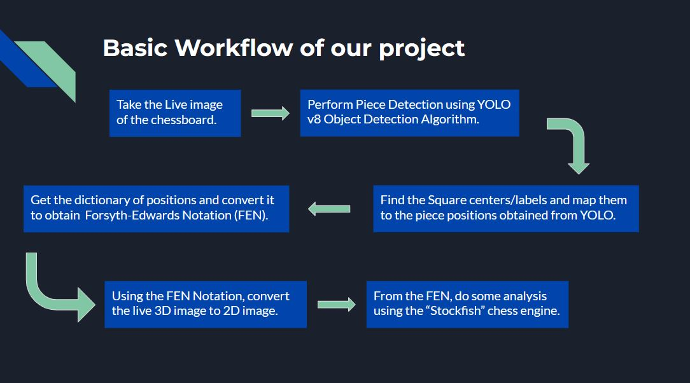

# ♟📊Chess Prognosticator - ***Checkmate Reimagined*** 📈♟
***

### **TEAM MEMBERS:**
***
- K SAI DINESH (CS20B1122)
- SAKETH RAMA (CS20B1042)
- ABHINOW (CS20B1066)

### **ABOUT OUR PROJECT:**
***
In this Project, we apply Computer Vision and Image Processing Techniques to process the live 3D image of the chessboard and obtain the Forsyth-Edwards Notation (FEN) of the board's configuration. We later use this FEN representation and feed it to Stockfish AI Chess Engine which analyses the FEN and gives appropriate suggestions such as:
- 2D Board Image of the live chessboard.
- Best move to make and top 3 moves.
- Checkmate and Capture Status.
- Centipawn value associated with each move.
- Win-Draw-Loss (WDL) Statistics.

We also developed a streamlit application in which we upload the chessboard image and specify the Side To Move (STM). It performs the prognosis as mentioned in the above steps and displays the results. Below is the preview of how the web application looks for a sample I/P:

After performing analysis, this is how the results are shown:

Now, we shall see how the backend works for generating FEN notation for the I/P chessboard.

***
### **WORKFLOW OF THE PROJECT**
***

### **CHESS PIECE DETECTION**
***
Done using YOLOv8 model on the Chess Pieces Dataset obtained from Roboflow (see the references). The output of the YOLOv8 model is a JSON object which contains information about the bounding boxes surrounding the chess pieces. From these, we get the midpoint of the bottom line of the bounding box for each chess piece. This is required to determine the position of the chess piece on the board (eg., a2, b4, d7, h3, etc.).

### **CHESS BOARD DETECTION**
***
We approached this problem using 2 approaches. One is through Labelling and other is through Minimum Distance Assignment. They are discussed in detailed below:

***
#### **Approach 1 : Labelling Chessboard Squares**
***
- Finding Four Corner Points:
   - Apply hough lines
- Get corners from intersection of lines
   - Locating Chess Board Positions:
   - Find perspective projection using corners
   - Find cell width and cell height by dividing into 8x8 cells
   - Find projective coordinates for center of bottom line of bounding box
   - Label the image with unique pixel values for each chess board position
Find chess board positions from pixel values of transformed centers of bottom line of their bounding boxes and store them in dictionary
- Converting to FEN:
  - Convert dictionary to FEN

***
#### **Approach 2 : Minimum Distance Square Assignment**
***
- Find Corners and Perspective Transform (same as approach 1).
- Label Squares:
  - Find width and height of projective image
  - Divide projected image into 16x16 grid
  - Find Square centers from the Intersection points of grid
- Square Assignment:
  - Minimum Distance Classification
  - Distance Metric: L2/Euclidean distance
  - Store nearest cell’s position in dictionary
- Converting to FEN:
  - Convert dictionary to FEN

 #### We finally sent this FEN representation to the Stockfish Chess Engine to perform the analysis and give back the results & suggestions.
 
***
### **REFERENCES:**
***
- [YOLOv8 Custom Training Notebook](https://colab.research.google.com/github/roboflow-ai/notebooks/blob/main/notebooks/train-yolov8-object-detection-on-custom-dataset.ipynb)
- [Chess Pieces Dataset - Roboflow](https://public.roboflow.com/object-detection/chess-full)
- [Python Chess Library](https://python-chess.readthedocs.io/en/latest/)
- [Stockfish AI Chess Engine](https://pypi.org/project/stockfish/)
- [Board Game Image Recognition using Neural Networks](https://towardsdatascience.com/board-game-image-recognition-using-neural-networks-116fc876dafa)
